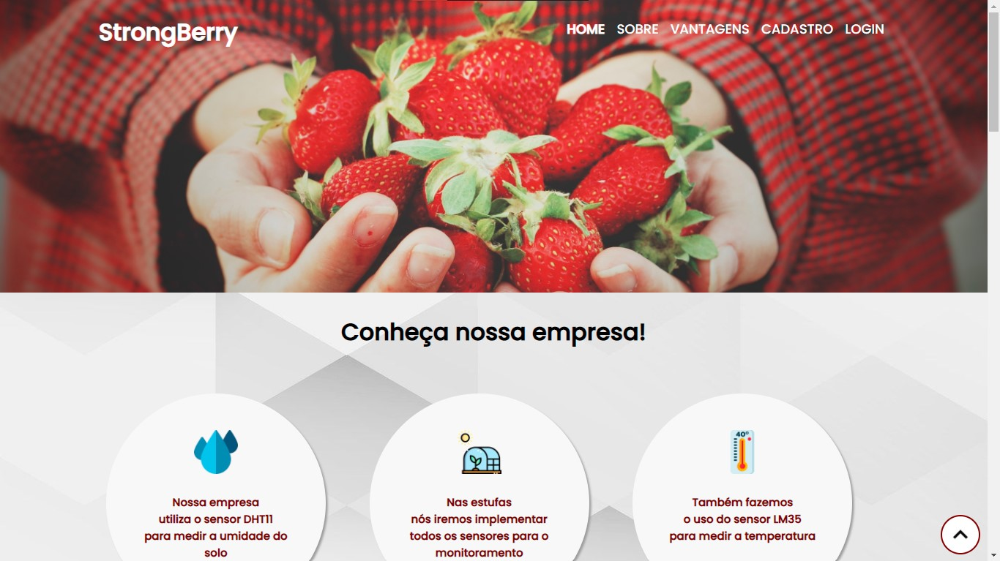
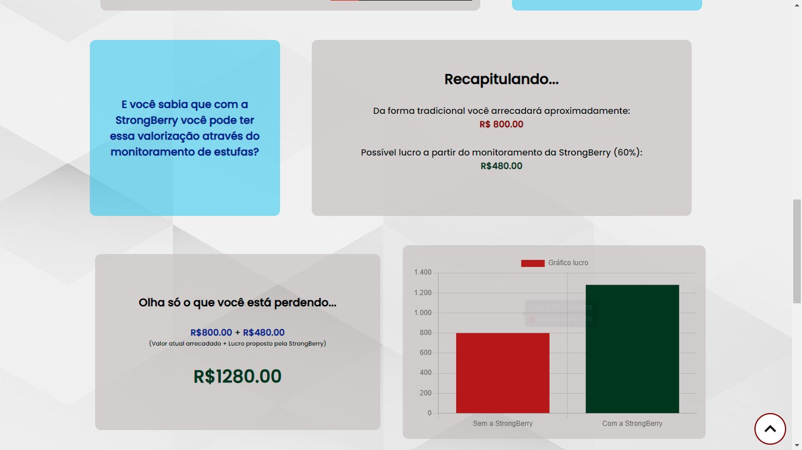
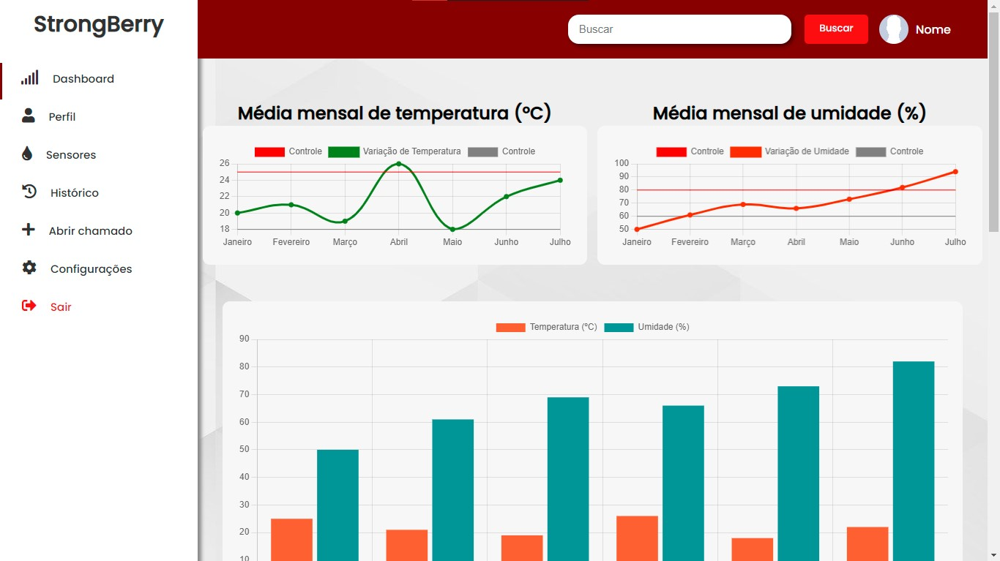

<p align="center">
   
   <a href="https://github.com/AntonioGally/PI_1_Semestre/stargazers">
    
  </a>

</p>
<!-- 
<h1 align="center">
    
</h1> -->

<h4 align="center"> 
	🚧 StrongBerry 🍓🍓🍓 em construção  🚧
</h4>

<p align="center">
 <a href="#-sobre-o-projeto">Sobre</a> •
 <a href="#-funcionalidades">Funcionalidades</a> •
 <a href="#-layout">Layout</a> • 
 <a href="#-como-executar-o-projeto">Como executar</a> • 
 <a href="#-tecnologias">Tecnologias</a> • 
</p>

## 💻 Sobre o projeto

🍓 StrongBerry - Uma empresa que automatiza plantações de morango por meio de estufas controladas via software.

---

## ⚙️ Funcionalidades

- [x] Temperatura

  - [x] Verificar Temperatura
  - [x] Verificar grandes variações

- [x] Umidade

  - [x] Verificar umidade
  - [x] Verificar grandes variações

- [x] Ocorrências

  - [x] Gerar notificação de problema
  - [x] Armazenar histórico de notificações
  - [x] Mostrar a gravidade do prblema

- [x] Simulador

  - [x] Fazer comparação de lucro sem os nossos serviços
  - [x] Exibir produção ganha

---

## 🎨 Layout

---

### Prints

<p align="center" style="display: flex; align-items: flex-start; justify-content: center; flex-direction:column;">
  
  
  
</p>

---

## 🚀 Como executar o projeto

### Pré-requisitos

Antes de começar, você vai precisar ter instalado em sua máquina as seguintes ferramentas:
[Git](https://git-scm.com), [Node.js](https://nodejs.org/en/).
Além disto é bom ter um editor para trabalhar com o código como [VSCode](https://code.visualstudio.com/)

#### 🧭 Rodando a aplicação web (Frontend)

```bash

# Clone este repositório
$ git clone https://github.com/AntonioGally/PI_1_Semestre.git

# Acesse a pasta do projeto no seu terminal/cmd
$ cd PI_1_Semestre

# Abra o projeto com vsCode
$ code .

```

## 🛠 Tecnologias

As seguintes ferramentas foram usadas na construção do projeto:

#### **Website** ([React](https://reactjs.org/) + [TypeScript](https://www.typescriptlang.org/))

- **[HTML](https://www.w3schools.com/html/)**
- **[CSS](https://www.w3schools.com/css/)**
- **[JS](https://developer.mozilla.org/pt-BR/docs/Web/JavaScript)**
- **[Bootstrap](https://getbootstrap.com)**

## 💪 Como contribuir para o projeto

1. Faça um **fork** do projeto.
2. Crie uma nova branch com as suas alterações: `git checkout -b my-feature`
3. Salve as alterações e crie uma mensagem de commit contando o que você fez: `git commit -m "feature: My new feature"`
4. Envie as suas alterações: `git push origin my-feature`

---

<!-- ## 🦸 Autor

<a href="https://www.antoniogally.tk/#/">
 
 <br />
 <br /> -->

---
